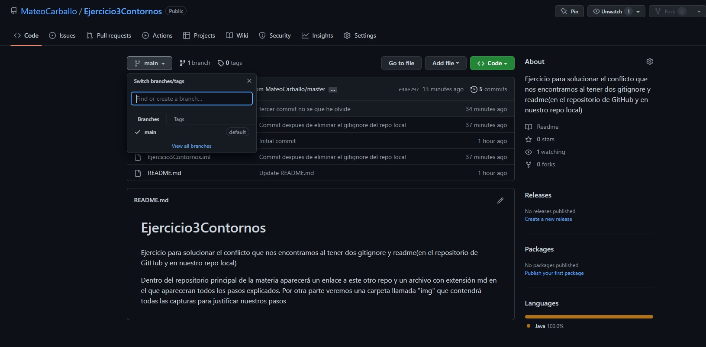

# Ejercicio 3 CD. Conflictos al tener varios archivos .gitignore.

Enlace al repositorio en el que se ha realizado este trabajo: <https://github.com/MateoCarballo/Ejercicio3Contornos>

1. Creamos un nuevo proyecto y un nuevo repositorio (fuera de los principales de la materia lo referenciaremos con un enlace)
2. Ese repositorio llamado Ejercicio3 GitHub lo crearemos con un gitignore y un readme.
Estos entrarán en conflicto con los otros del proyecto y tendremos que solucionarlo.
3. Creamos el proyecto en IntelliJIdea y marcamos la casilla de crear repo en GitHub.


4. Comprobamos que el proyecto esta vacio y sin comitear pero tenemos archivos añadidos en el área intermedia que no hemos añadido mediante el comando
```bash
"git add" <nombre fichero>
```


5. Intentamos pullear pero vemos que aborta. Hay un conflito al tener archivos duplicados en el repo remoto y el staging area.


6. Borramos todos los archivos del area intermedia, deshacemos el paso previo al commit   
7. 

7. Aunque borremos los archivos del area intermedia seguimos con el mismo problema. La solucion a esto es eliminar el archivo .gitignore de nuestro repo local. Una vez lo hayamos hecho ya podremos pullear desde el repo remoto

[label](img/5.%20Vuelve%20a%20salir%20el%20error%20de%20conflicto%20aun%20habiendo%20quitado%20todos%20los%20elementos%20del%20area%20intermedia.jpg%0D) 


8. Una vez hecho esto añadimos al staging area y comiteamos


9. Añado un commit mas porque me olvide de alguno, no se cuando ni como.

.jpg)

10. Lo subimos al repo una vez hemos comiteado cambios. En mi caso no me dejaba subirlo a la direccion que habia añadido antes asi que la elimino y vuelvo a añadir una.

.jpg)

[label](img/9.%20No%20me%20deja%20subirlo%20con%20el%20remoto%20a%C3%B1adido%20al%20principio%20lo%20borramos%20y%20volvemos%20a%20intentarlojpg.jpg%0D) .jpg)

11. En GitHub nos avisa que este repo ha sido pusheado y que va un par de commits por delante

[label](img/10.%20En%20Github%20ya%20nos%20avisa%20que%20ha%20sido%20pusheado%20.jpg%0D) [label](img/8.No%20me%20dejaba%20comitear%20me%20faltaba%20algo%20por%20a%C3%B1adir(problema%20solucionado%20con%20otro%20commit).jpg%0D) 


[label](img/10.1%20.jpg%0D) [label](img/8.No%20me%20dejaba%20comitear%20me%20faltaba%20algo%20por%20a%C3%B1adir(problema%20solucionado%20con%20otro%20commit).jpg%0D) [label](img/9.%20No%20me%20deja%20subirlo%20con%20el%20remoto%20a%C3%B1adido%20al%20principio%20lo%20borramos%20y%20volvemos%20a%20intentarlojpg.jpg%0D) 


[label](img/10.2%20.jpg%0D) [label](img/8.No%20me%20dejaba%20comitear%20me%20faltaba%20algo%20por%20a%C3%B1adir(problema%20solucionado%20con%20otro%20commit).jpg%0D) [label](img/9.%20No%20me%20deja%20subirlo%20con%20el%20remoto%20a%C3%B1adido%20al%20principio%20lo%20borramos%20y%20volvemos%20a%20intentarlojpg.jpg%0D) [label](img/10.%20En%20Github%20ya%20nos%20avisa%20que%20ha%20sido%20pusheado%20.jpg%0D) 

12. Por ultimo copiamos, desde GitHub, la rama master en la rama main y una vez hecho eliminamos la rama main.

[label](img/11.%20Copia%20master%20en%20main%20y%20despues%20elimino%20la%20rama%20master(pusheada%20desde%20el%20remoto).jpg%0D) [label](img/8.No%20me%20dejaba%20comitear%20me%20faltaba%20algo%20por%20a%C3%B1adir(problema%20solucionado%20con%20otro%20commit).jpg%0D) [label](img/9.%20No%20me%20deja%20subirlo%20con%20el%20remoto%20a%C3%B1adido%20al%20principio%20lo%20borramos%20y%20volvemos%20a%20intentarlojpg.jpg%0D) [label](img/10.%20En%20Github%20ya%20nos%20avisa%20que%20ha%20sido%20pusheado%20.jpg%0D) [label](img/10.1%20.jpg%0D) 


13. Forma Final del ejercicio


